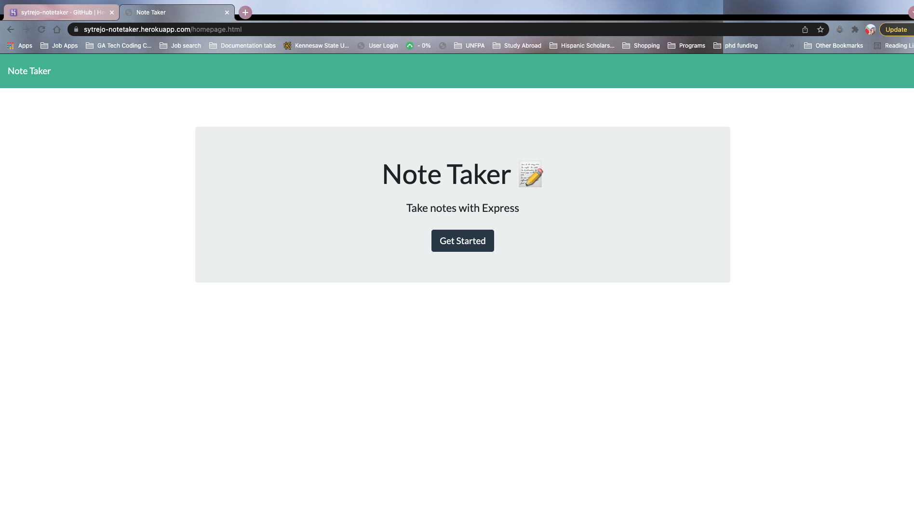

# NoteTaker
1. [Description](#Description)
2. [Installation](#Installation)
3. [Usage](#Usage)
4. [Deployment](#Deployment)
5. [Screenshots](#Screenshots)

## Description

An App to help users keep track of their notes. 

## Installation

To install the code, you can clone the repo. Use the terminal to initiate the program by using the command line and go to the local host port.

## Usage

The app is intuitive. So click the pencil to write a new note, click the floppy disk to save the note, click the garbage can to delete notes. 

## Deployment

Video Link: [Google Drive Link to Video](https://drive.google.com/file/d/11quJPYW9k_lUgst3ums4GoET1WmqnuIh/view?usp=sharing)

Repo Link: [Github Repo](https://github.com/sytrejo/NoteTaker)

## Screenshots

